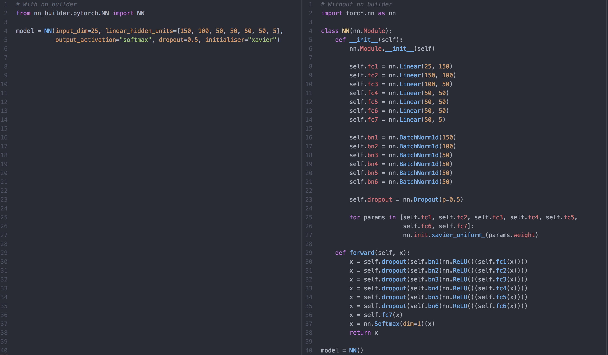
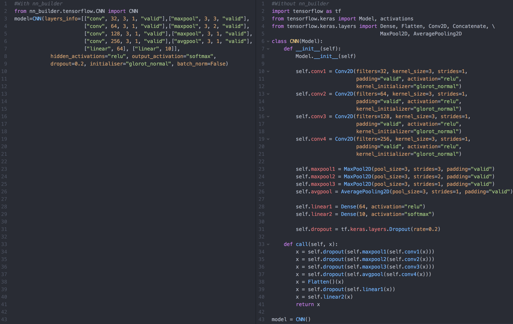

 [](https://github.com/dwyl/esta/issues) 


**nn_builder builds neural networks in 1 line**. You specify the type of network you want and it builds it.

### Install

`pip install nn_builder`

### Support

| Network Type       | **NN**  | **CNN** | **RNN** |
| ------- | ------- | ------- | ------- |
| PyTorch     | :heavy_check_mark: | :heavy_check_mark:    | :heavy_check_mark:    |
| TensorFlow 2.0  |        :heavy_check_mark:  |  :heavy_check_mark: | :heavy_check_mark: |                             |


### Examples

On the left is how you can create the PyTorch neural network on the right in only 1 line of code using nn_builder:



Similarly for TensorFlow on the left is how you can create the CNN on the right in only 1 line of code using nn_builder: 



### Usage

See this [colab notebook](https://colab.research.google.com/drive/1UdMT3aVSV0L5Rq11nyLHxMSVtTVZryhW) for lots of examples of how to use the module. 
3 types of PyTorch and TensorFlow network are currently supported: NN, CNN and RNN. Each network takes the following arguments:

| Field | Description | Default |
| :---: | :----------: | :---: |
| *input_dim*| Dimension of the input into the network. See below for more detail. Not needed for Tensorflow.  | N/A |
| *layers_info* | List to indicate the layers of the network you want. Exact requirements depend on network type, see below for more detail  | N/A |
| *output_activation* | String to indicate the activation function you want the output to go through. Provide a list of strings if you want multiple output heads | No activation |                              
| *hidden_activations* | String or list of string to indicate the activations you want used on the output of hidden layers (not including the output layer), default is ReLU and for example "tanh" would have tanh applied on all hidden layer activations | ReLU after every hidden layer |
| *dropout* | Float to indicate what dropout probability you want applied after each hidden layer | 0 |
| *initialiser* | String to indicate which initialiser you want used to initialise all the parameters | PyTorch & TF Default |
| *batch_norm* | Boolean to indicate whether you want batch norm applied to the output of every hidden layer | False |
| *columns of_data_to_be_embedded* | List to indicate the column numbers of the data that you want to be put through an embedding layer before being fed through the hidden layers of the network | No embeddings |
| *embedding_dimensions* | If you have categorical variables you want embedded before flowing through the network then you specify the embedding dimensions here with a list of the form: [ [embedding_input_dim_1, embedding_output_dim_1], [embedding_input_dim_2, embedding_output_dim_2] ...] | No embeddings |
| *y_range* | Tuple of float or integers of the form (y_lower, y_upper) indicating the range you want to restrict the output values to in regression tasks | No range |
| *random_seed* | Integer to indicate the random seed you want to use | 0 |
| *return_final_seq_only* | Only needed for RNN. Boolean to indicate whether you only want to return the output for the final timestep (True) or if you want to return the output for all timesteps (False) | True |

Each network type has slightly different requirements for **input_dim** and **layers_info** as explained below:

--- 

##### 1. NN

* **input_dim**: # Features in PyTorch, not needed for TensorFlow
* **layers_info**: List of integers to indicate number of hidden units you want per linear layer. 
* For example:

```
from nn_builder.pytorch.NN import NN   
model = NN(input_dim=5, layers_info=[10, 10, 1], output_activation=None, hidden_activations="relu", 
           dropout=0.0, initialiser="xavier", batch_norm=False)            
```
--- 
##### 2. CNN

* **input_dim**: (# Channels, Height, Width) in PyTorch, not needed for TensorFlow
* **layers_info**: We expect the field *layers_info* to be a list of lists indicating the size and type of layers that you want. Each layer in a  CNN can be one of these 4 forms: 
    * ["conv", channels, kernel size, stride, padding] 
    * ["maxpool", kernel size, stride, padding]
    * ["avgpool", kernel size, stride, padding]
    * ["linear", units]
* For a PyTorch network kernel size, stride, padding and units must be integers. For TensorFlow they must all be integers except for padding which must be one of {“valid”, “same”} 
* For example:
```
from nn_builder.pytorch.CNN import CNN   
model = CNN(input_dim=(3, 64, 64), 
            layers_info=[["conv", 32, 3, 1, 0], ["maxpool", 2, 2, 0], 
                         ["conv", 64, 3, 1, 2], ["avgpool", 2, 2, 0], 
                         ["linear", 10]],
            hidden_activations="relu", output_activation="softmax", dropout=0.0,
            initialiser="xavier", batch_norm=True)
```
--- 
##### 3. RNN

* **input_dim**: # Features in PyTorch, not needed for TensorFlow
* **layers_info**: We expect the field *layers_info* to be a list of lists indicating the size and type of layers that you want. Each layer in a  CNN can be one of these 4 forms: 
    * ["lstm", units] 
    * ["gru", units]
    * ["linear", units]
* For example:

```
from nn_builder.pytorch.CNN import CNN   
model = RNN(input_dim=5, layers_info=[["gru", 50], ["lstm", 10], ["linear", 2]],
            hidden_activations="relu", output_activation="softmax", 
            batch_norm=False, dropout=0.0, initialiser="xavier")
```
--- 
## Contributing

Together we can make something that is useful for thousands of people. Anyone is very welcome to contribute via a pull request. Please see the [issues](https://github.com/p-christ/nn_builder/issues) 
page for ideas on the best areas to contribute to and try to:
1. Add tests to the tests folder that cover any code you write
1. Write comments for every function
1. Create a colab notebook demonstrating how any extra functionality you created works

 

 


