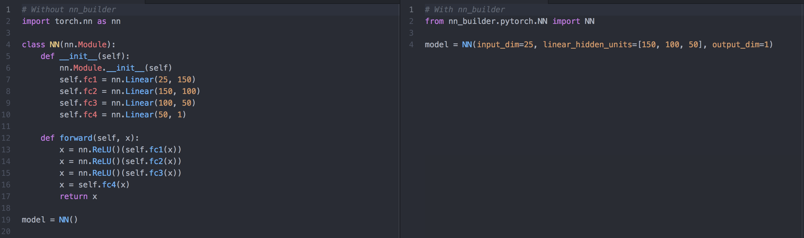
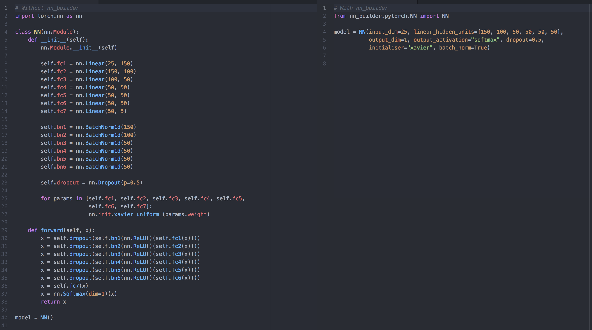

# Neural Network Builder (nn_builder)

Create neural networks in 1 line.

nn_builder makes it easy for you to create neural networks.  On the left is the code you would need to write to create a 
PyTorch neural network equivalent to the one line of code on the right using nn_builder. 

For more complicated networks the difference becomes even larger:

## Usage

Download with: `pip install nn_builder`

### 1. PyTorch NN Module

To import the PyTorch NN module run: 

`from nn_builder.pytorch.NN import NN`

NN then takes the following fields:
`
1. ***input_dim***: integer to indicate the dimension of the input into the network
1. ***linear_hidden_units***: list of integers to indicate the width and number of linear hidden layers you want in your network
1. ***output_dim***: integer to indicate the dimension of the output of the network
1. ***output_activation***: string to indicate the activation function you want the output to go through. Default is no activation 
and then for example "softmax" puts it through a softmax activation, and "sigmoid" through a sigmoid activation.
1. ***hidden_activations***: string or list of string to indicate the activations you want used on the output of hidden layers (not including the output layer),
default is ReLU and for example "tanh" would have tanh applied on all hidden layer activations
1. print_model_summary: boolean to indicate whether you want a model summary printed after model is created
`

input_dim: int, linear_hidden_units: list, output_dim: int, output_activation: str ="None",
                 hidden_activations="relu", dropout: float =0.0, initialiser: str ="default", batch_norm: bool =False,
                 embedding_dimensions: list =[], print_model_summary: bool =False

Notebook to play around with: https://colab.research.google.com/drive/1abxTEaUrJqbTuk8e8tOa3y9DYQQVrF_N
